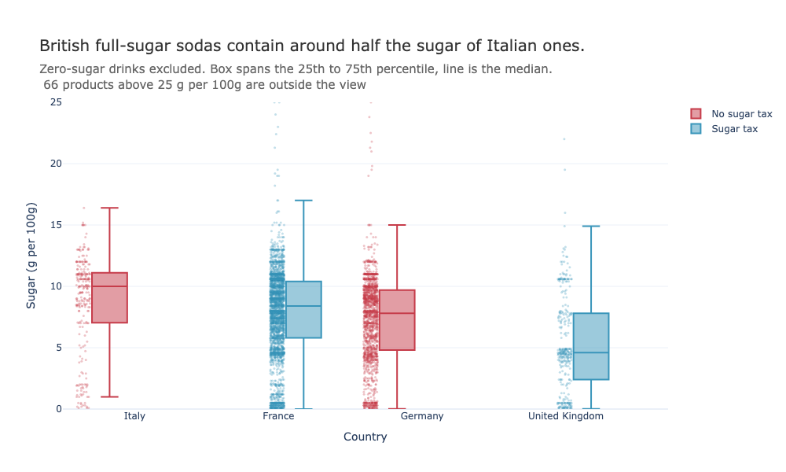
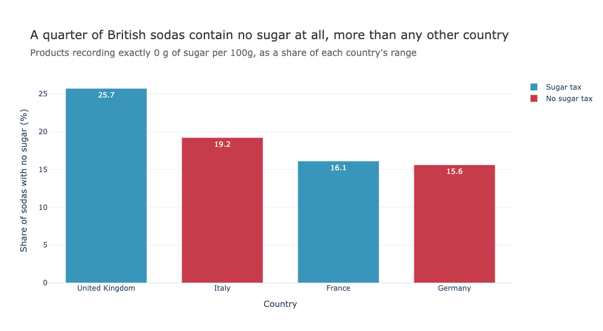

# ME204 Final Project: DO SOFT DRINKS SOLD IN THE UK AND FRANCE CONTAIN LESS SUGAR THAN THOSE SOLD IN GERMANY AND ITALY?


| GitHub username                           | LSE ID            |
| ----------------------------------------- | ----------------- |
| JaviMilagro                               | 250100007         |


## Overview

Sugar taxes are meant to give manufacturers a financial reason to reformulate
their drinks, so a market where sugary drinks are taxed should end up with less
sugar on the shelves. This project tests that by comparing the sugar content of
sodas sold in two taxed markets (United Kingdom, France) against two untaxed ones
(Germany, Italy).

Italy is a borderline case handled deliberately: Italian law contains a sugar tax
enacted in 2019, but it has been postponed repeatedly and has never come into
force, so Italy counts as untaxed here. NB01 sets out the policy sources for all
four countries.

## Data sources

[Open Food Facts](https://world.openfoodfacts.org), a free and open database of
food products built by volunteers, available under the Open Database License.
Data is collected through the Search-a-licious search API at
`https://search.openfoodfacts.org/search`.

The project collects **every soda the database holds** for the four countries:
6,557 products in total (512 UK, 3,765 France, 1,943 Germany, 337 Italy).

## How to reproduce

**Python packages:** `pandas`, `plotly`, `requests`. Everything else used
(`json`, `pathlib`) is in the standard library.

**Credentials: none required.** Open Food Facts does not need an API key or an
account for reading data.

**One thing you must change, though.** The API's terms ask every user to identify
themselves with a custom `User-Agent` header containing an app name and a contact
email. Mine is hidden in a .env file. You have to change that in order to work:

```python
HEADERS = {"User-Agent": "ME204-LSE-project/1.0 <YOUR EMAIL HERE>"}
```

Replace the YOUR EMAIL HERE with your own before running NB01, so the traffic is attributed
to you directly. 

## Run order

Run the three notebooks in order. Each depends on the output of the one before.

| # | Notebook | Reads | Does | Writes |
|---|---|---|---|---|
| 1 | `NB01-Data-Collection.ipynb` | Open Food Facts API | Paginates through every soda for each of the four countries, 100 products per request | `data/raw/united-kingdom.json`, `france.json`, `germany.json`, `italy.json` |
| 2 | `NB02-Data-Transformation.ipynb` | `data/raw/*.json` | Flattens the nested JSON into one row per product per country, counts missing sugar values, checks for products shared between countries, drops rows with no sugar value | `data/processed/sodas_clean.csv` (6,086 rows) |
| 3 | `NB03-Data-Analysis.ipynb` | `data/processed/sodas_clean.csv` | Classifies countries by tax status, separates zero-sugar from full-sugar drinks, compares sugar content across countries, produces two charts | `docs/sugar_by_country.png` & `docs/diet_by_country.png`|

## Findings 

The answer is no, not reliably — but one of the two taxed countries looks
dramatically different from everyone else.

1. **Tax status on its own predicts nothing.** Pooled into taxed and untaxed, the
   two groups are indistinguishable (6.61 vs 6.67 g of sugar per 100g). This is
   misleading rather than informative: France supplies 89% of the taxed group and
   Germany 85% of the untaxed one, so two similar countries cancel everything else
   out.

2. **The United Kingdom is the outlier, on two measures at once.** A quarter of
   British sodas contain no sugar at all (25.7%, against 15.6–19.2% elsewhere),
   *and* the British drinks that do contain sugar have a median of 4.60 g per 100g
   against Germany's 7.80 and Italy's 10.00. Removing the diet drinks does not
   close the gap, so this is not simply a matter of more zero-sugar variants on
   the shelves.

3. **France has the same policy and none of the result.** French sodas contain
   more sugar than untaxed Germany's (8.22 vs 7.68 with diet drinks excluded).
   Two taxed countries, opposite outcomes — so having a sugar tax is not what
   separates the United Kingdom from the rest.




